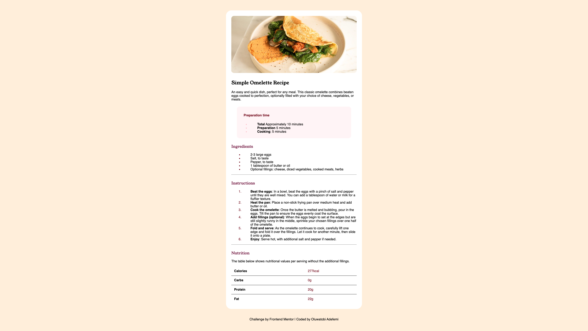

## Table of contents

- [Overview](#overview)
  - [Screenshot](#screenshot)
  - [Built with](#built-with)
  - [What I learned](#what-i-learned)
  - [Continued development](#continued-development)

## Overview

### Screenshot

### Built with

- HTML5 markup
- CSS 
- Flexbox

### What I learnt

- I learnt how to design tables 
- I also leant how to add colors to ul icon

### Continued development

I want to continue devloping on flexbox and all of my front end. I also want to develop on writing clean codes. 
